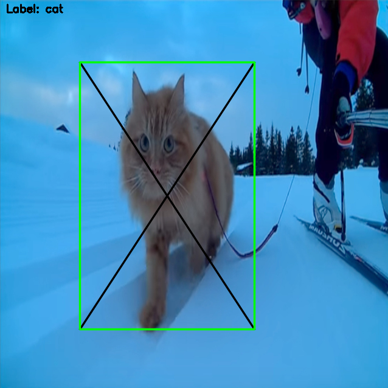
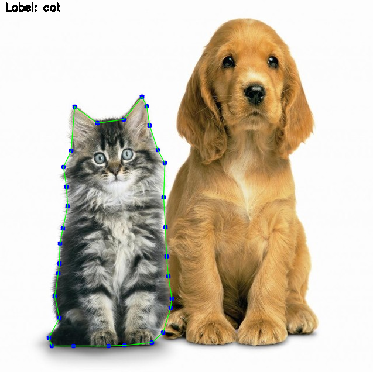

# Toolbox

## 1. ImageMarker
This tool assists in labeling images for object detection and segmentation.

Formats supported for Detection:
* KITTI - Used in Nvidia Digits
* VOC   - *Not implemented yet*

Formats supported for Segmentation:
* Grayscale Image Labels
* RGB Image Labels - *Not implemented yet*

### How to use?
```bash
python ImageMarkerTool.py

# Arguments
--input, -in                # Path to images folder.
--output, -out              # Path where labels will be saved.
--labels, -l                # List of objects to label, MUST BE IN ALPHABETICAL ORDER.
--mode, -m                  # Labeling mode used.
                            #   - detection (default)
                            #   - segmentation.
--label_format, -lf         # Optional argument for detection labeling.
                            #   - kitti (default)
                            #   - voc
                            
# Controls   
-- 'a'                      # Show the left image on the list.
-- 'd'                      # Show the right image on the list.
-- 's'                      # Find next image unlabelled.
-- 'r'                      # Remove last label created on the current image.
-- '1'                      # Change the selected label cycling trough all of them.
-- 'g'                      # Generate output labels for all images using the selected label format.
-- 'q'                      # Close the application
                            
```

### Detection Mode
To label images for detection, we use a bounding box.
Simply click and drag to create a box for each object of interest in the image.




### Segmentation Mode
To label image for segmentation, we use a polygon shape.
Left Click in all points following the shape of the object of interest in the image,
to close the polygon correctlye use a "RIGHT CLICK" 




### Requirements

* Python 3.6+
* Opencv 3.0+
* Numpy 1.11+
